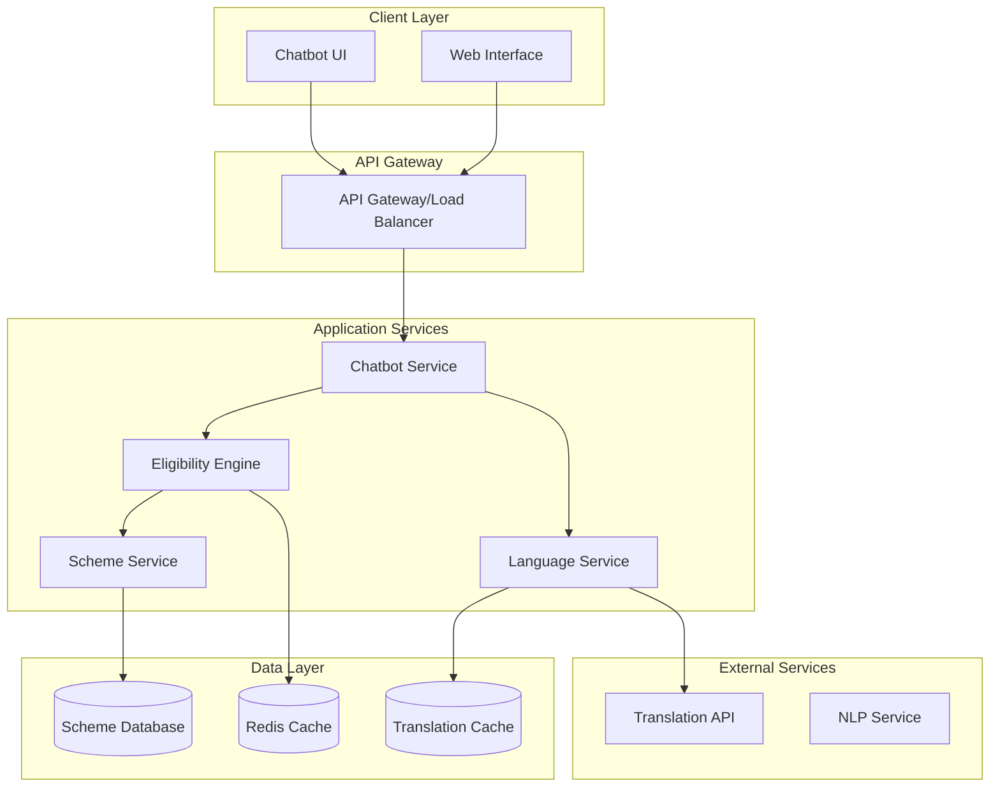

# Design Document: Government Scheme Eligibility Assistant

## Overview

The Government Scheme Eligibility Assistant is a web-based AI chatbot system that helps Indian citizens discover government welfare schemes they are eligible for. The system addresses the critical gap between scheme availability and citizen awareness by providing a simple, multilingual interface that requires no registration and works across devices with varying internet connectivity.

The solution leverages modern web technologies, AI-powered natural language processing, and a rule-based eligibility matching engine to provide personalized scheme recommendations. The architecture prioritizes accessibility, performance, and scalability while maintaining data privacy and security standards.

## Architecture

The system follows a microservices architecture with clear separation of concerns:



### Key Architectural Principles

1. **Stateless Services**: All services are stateless to enable horizontal scaling
2. **Caching Strategy**: Multi-level caching for performance optimization
3. **Language Isolation**: Separate service for translation to enable independent scaling
4. **Data Privacy**: No persistent storage of user personal information
5. **Fault Tolerance**: Graceful degradation when external services are unavailable

## Components and Interfaces

### 1. Web Interface Component

**Responsibilities:**
- Responsive web UI that works on desktop, tablet, and mobile devices
- Progressive Web App (PWA) capabilities for offline functionality
- Accessibility compliance (WCAG 2.1 AA standards)
- Language selection and switching

**Technology Stack:**
- Frontend: React.js with TypeScript for type safety
- Styling: Tailwind CSS for responsive design
- PWA: Service workers for offline capability
- Accessibility: ARIA labels and keyboard navigation support

**Key Interfaces:**
```typescript
interface WebInterface {
  renderChatbot(): ChatbotComponent;
  handleLanguageSelection(language: string): void;
  displaySchemeResults(schemes: SchemeResult[]): void;
  showErrorMessage(error: ErrorMessage): void;
}
```

### 2. Chatbot Service

**Responsibilities:**
- Natural language understanding and conversation flow management
- User input validation and sanitization
- Session management without persistent storage
- Integration with eligibility engine and language services

**Technology Stack:**
- Backend: Node.js with Express.js
- NLP: Integration with pre-trained multilingual models (BharatGen or similar)
- Session: In-memory session management with Redis for scaling
- Validation: Joi for input validation

**Key Interfaces:**
```typescript
interface ChatbotService {
  processUserMessage(message: string, sessionId: string): Promise<ChatbotResponse>;
  initializeSession(language: string): SessionContext;
  validateUserInput(input: UserInput): ValidationResult;
  generateResponse(intent: Intent, context: SessionContext): Promise<string>;
}

interface UserInput {
  age?: number;
  gender?: 'male' | 'female' | 'other';
  state: string;
  incomeRange: IncomeRange;
  occupation: string;
}
```

### 3. Eligibility Engine

**Responsibilities:**
- Rule-based matching of user profiles against scheme criteria
- Proximity scoring for partial matches
- Probability scoring using matrix completion techniques
- Performance optimization through caching and indexing

**Algorithm Design:**
The eligibility engine implements a two-score system based on research from IDinsight:

1. **Proximity Score**: Measures certainty of eligibility (-1 to 1 scale)
2. **Probability Score**: Likelihood of eligibility using statistical inference

**Key Interfaces:**
```typescript
interface EligibilityEngine {
  evaluateEligibility(profile: UserProfile): Promise<EligibilityResult[]>;
  calculateProximityScore(profile: UserProfile, scheme: Scheme): number;
  calculateProbabilityScore(profile: UserProfile, scheme: Scheme): Promise<number>;
  rankSchemes(results: EligibilityResult[]): EligibilityResult[];
}

interface EligibilityResult {
  scheme: Scheme;
  proximityScore: number;
  probabilityScore: number;
  matchedCriteria: string[];
  missingCriteria: string[];
}
```

### 4. Language Service

**Responsibilities:**
- Multi-language support for 22 scheduled Indian languages
- Translation caching for performance
- Fallback mechanisms for translation failures
- Consistent terminology management

**Technology Stack:**
- Translation: Integration with BHASHINI API or Google Translate API
- Caching: Redis for translation cache
- Terminology: JSON-based glossary management
- Fallback: English as default with user notification

**Key Interfaces:**
```typescript
interface LanguageService {
  translateText(text: string, targetLanguage: string): Promise<string>;
  translateScheme(scheme: Scheme, targetLanguage: string): Promise<TranslatedScheme>;
  getSupportedLanguages(): Language[];
  validateLanguage(languageCode: string): boolean;
}
```

### 5. Scheme Service

**Responsibilities:**
- Government scheme data management and retrieval
- Scheme metadata and eligibility criteria storage
- Version control for scheme updates
- Data validation and integrity checks

**Key Interfaces:**
```typescript
interface SchemeService {
  getAllSchemes(): Promise<Scheme[]>;
  getSchemesByCategory(category: string): Promise<Scheme[]>;
  updateScheme(scheme: Scheme): Promise<void>;
  validateSchemeData(scheme: Scheme): ValidationResult;
}
```

## Data Models

### Core Data Structures

```typescript
interface UserProfile {
  age: number;
  gender: 'male' | 'female' | 'other';
  state: string;
  incomeRange: IncomeRange;
  occupation: string;
  sessionId: string;
  timestamp: Date;
}

interface Scheme {
  id: string;
  name: string;
  description: string;
  category: SchemeCategory;
  eligibilityCriteria: EligibilityCriteria;
  benefits: string[];
  applicationProcess: ApplicationStep[];
  requiredDocuments: string[];
  contactInfo: ContactInfo;
  lastUpdated: Date;
}

interface EligibilityCriteria {
  ageRange?: { min: number; max: number };
  gender?: 'male' | 'female' | 'other' | 'any';
  states: string[];
  incomeRange?: IncomeRange;
  occupations?: string[];
  additionalCriteria?: Record<string, any>;
}

interface IncomeRange {
  min: number;
  max: number;
  currency: 'INR';
  period: 'annual' | 'monthly';
}

enum SchemeCategory {
  HEALTH = 'health',
  EDUCATION = 'education',
  EMPLOYMENT = 'employment',
  HOUSING = 'housing',
  AGRICULTURE = 'agriculture',
  SOCIAL_SECURITY = 'social_security',
  WOMEN_CHILD = 'women_child',
  SENIOR_CITIZEN = 'senior_citizen'
}
```

### Database Schema

The system uses a document-based database (MongoDB) for flexibility in storing scheme data with varying criteria structures:

```javascript
// Schemes Collection
{
  _id: ObjectId,
  schemeId: String, // Unique identifier
  name: {
    en: String,
    hi: String,
    // ... other languages
  },
  description: {
    en: String,
    hi: String,
    // ... other languages
  },
  category: String,
  eligibilityCriteria: {
    ageRange: { min: Number, max: Number },
    gender: String,
    states: [String],
    incomeRange: { min: Number, max: Number, period: String },
    occupations: [String],
    customCriteria: Object
  },
  benefits: [String],
  applicationProcess: [Object],
  requiredDocuments: [String],
  contactInfo: Object,
  isActive: Boolean,
  version: Number,
  createdAt: Date,
  updatedAt: Date
}
```

## Correctness Properties

*A property is a characteristic or behavior that should hold true across all valid executions of a system—essentially, a formal statement about what the system should do. Properties serve as the bridge between human-readable specifications and machine-verifiable correctness guarantees.*

### Property 1: Input Validation Completeness
*For any* incomplete user profile, the system should identify and request all missing required fields (age, gender, state, income range, occupation) before proceeding to eligibility matching.
**Validates: Requirements 1.2**

### Property 2: Invalid Input Rejection
*For any* user input containing invalid data (negative age, unrecognized state, invalid income range), the system should reject the input and request valid information without processing eligibility.
**Validates: Requirements 1.3**

### Property 3: Session Data Isolation
*For any* user session, all provided information should be available during the session but completely cleared when the session ends, with no persistent storage of personal data.
**Validates: Requirements 1.4, 6.1, 6.2**

### Property 4: Profile Confirmation Consistency
*For any* complete user profile, the system should confirm all collected details before proceeding to eligibility matching.
**Validates: Requirements 1.5**

### Property 5: Comprehensive Scheme Evaluation
*For any* complete user profile, the eligibility engine should evaluate the profile against all active schemes in the database and return all eligible schemes ranked by relevance score.
**Validates: Requirements 2.1, 2.2, 2.3**

### Property 6: Fallback Scheme Suggestions
*For any* user profile that matches no schemes exactly, the system should return suggestions for similar schemes with modified criteria rather than an empty result set.
**Validates: Requirements 2.4**

### Property 7: Language Consistency
*For any* selected language and any scheme information, all interface elements and scheme content should be consistently translated to the selected language.
**Validates: Requirements 3.2, 3.3**

### Property 8: Translation Fallback Reliability
*For any* translation failure, the system should fall back to English content and notify the user of the language service unavailability.
**Validates: Requirements 3.5**

### Property 9: Scheme Information Completeness
*For any* eligible scheme presented to a user, the response should include scheme name, description, key benefits, and when requested, complete application details including process, required documents, and contact information.
**Validates: Requirements 4.1, 4.2**

### Property 10: Scheme Categorization Consistency
*For any* set of multiple eligible schemes, they should be organized and presented by category (health, education, employment, etc.) in a consistent manner.
**Validates: Requirements 4.5**

### Property 11: Scheme Database Integrity
*For any* scheme in the database, it should contain all required fields (eligibility criteria, benefits, application procedures) and any updates should maintain version history while being immediately available for matching.
**Validates: Requirements 7.1, 7.3, 7.4, 7.5**

## Error Handling

### Input Validation Errors
- **Invalid Age**: Reject negative values, ages over 150, or non-numeric input
- **Invalid State**: Validate against list of Indian states and union territories
- **Invalid Income**: Ensure positive values and valid currency format
- **Invalid Occupation**: Validate against predefined occupation categories

### Service Availability Errors
- **Translation Service Down**: Fall back to English with user notification
- **Database Unavailable**: Return cached results if available, otherwise show maintenance message
- **NLP Service Failure**: Use rule-based parsing as fallback

### Data Integrity Errors
- **Corrupted Scheme Data**: Skip invalid schemes and log errors for admin review
- **Missing Translations**: Use English version with language unavailability notice
- **Session Timeout**: Clear session data and restart conversation flow

### Performance Degradation
- **High Load**: Implement request queuing and show wait time estimates
- **Slow Database**: Use cached results when available
- **Memory Constraints**: Prioritize active sessions and clear inactive ones

## Testing Strategy

### Dual Testing Approach

The system requires both unit testing and property-based testing for comprehensive coverage:

**Unit Tests** focus on:
- Specific examples of valid and invalid inputs
- Integration points between services
- Edge cases like empty databases or network failures
- Error condition handling and recovery

**Property-Based Tests** focus on:
- Universal properties that hold across all inputs
- Comprehensive input coverage through randomization
- Correctness guarantees for core business logic
- System behavior under various data conditions

### Property-Based Testing Configuration

**Framework Selection**: Use `fast-check` for JavaScript/TypeScript property-based testing

**Test Configuration**:
- Minimum 100 iterations per property test
- Each property test references its design document property
- Tag format: **Feature: government-scheme-assistant, Property {number}: {property_text}**

**Property Test Implementation Requirements**:
- Each correctness property must be implemented by a single property-based test
- Tests should generate random valid and invalid inputs
- Verify system behavior matches expected properties
- Include edge cases in random generation (empty strings, boundary values, etc.)

### Testing Coverage Requirements

**Core Functionality Tests**:
- Eligibility matching algorithm with various user profiles
- Multi-language translation consistency
- Input validation across all data types
- Session management and data privacy

**Integration Tests**:
- End-to-end user flows from input to scheme recommendations
- Service communication and error propagation
- Database operations and caching behavior
- External API integration (translation services)

**Performance Tests**:
- Response time under normal and high load
- Memory usage during concurrent sessions
- Database query performance with large scheme datasets
- Translation service response times

### Test Data Management

**Synthetic Data Generation**:
- Random user profiles covering all demographic combinations
- Comprehensive scheme database with various eligibility criteria
- Edge cases for boundary testing (minimum/maximum values)
- Invalid data patterns for validation testing

**Test Environment**:
- Isolated test database with known scheme data
- Mock translation services for consistent testing
- Configurable user session timeouts
- Logging and monitoring for test analysis